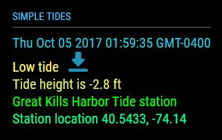
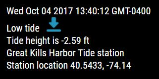

## MMM-SimpleTides

A simple tide module.

## S.O.P.

As usual, this module was not made to compete with any others. I make simple modules
because I enjoy doing it. I try to keep them small so that they don't use too much
screen real estate. My hope is that they are all informative, or fun, or both.

## What you get

* Date and time coinciding with tides
* High tide or Low tide with icon indicator
* Height variance of tide in feet or meters
* Name of the location of the tide station
* Tide station used is the closest to your longitude and latitude
* The actual longitude and latitude of tide station being used

## Examples

Default is white text. Annotated .css file included for sizing, and coloring.

* One colored with header, one plain white with no header.

, ,

## Installation

* `git clone https://github.com/mykle1/MMM-SimpleTides` into the `~/MagicMirror/modules` directory.

* Free and immediate apiKey @ https://www.worldtides.info/register

## Config.js entry and options

    {
		disabled: false,
		module: "MMM-SimpleTides",
		position: "top_left",
		config: {
			apiKey: "YOUR API KEY",          // free from https://www.worldtides.info/developer
			lat: "40.537661",                // your latitude
			lon: "-74.128333",               // your longitude
			height: "ft",                    // ft = feet, m = meters
			useHeader: false,                // False if you don't want a header      
			header: "",                      // Change in config file. useHeader must be true
			maxWidth: "300px",
			animationSpeed: 3000,            // fade speed
			rotateInterval: 15 * 1000,       // seconds between tides displayed
		}
	},
	
## Going fishing or boating?

* Knowing the tides will help you plan your trip